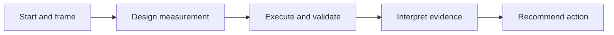

# Mark Ciganovic

## AI-Augmented Data Analyst

I use **SQL, R, Tidyverse, Excel, and Shiny** to investigate operational problems, compare decision options, and communicate evidence. My projects cover seller performance, service-request prioritization, and financial scenarios, with AI-assisted development and explicit validation.

My work begins with the decision behind a metric request, locks the measurement design before execution, validates results with explicit quality checks and documented evidence boundaries, and ends with an evidence-bounded recommendation.

## Featured work

| Project | What it demonstrates | Core tools |
|---|---|---|
| [**FulfillIQ 2.0**](https://github.com/markjamesc/fulfilliq-2.0) | Seller-performance simulation: independent SQL and R paths, documented reconciliation across 3,095 sellers, seven investigation candidates, and two unresolved cases | MySQL, SQL, R, Tidyverse |
| [**Chicago 311 Dispatch Priority**](https://github.com/markjamesc/chicago-311-dispatch-priority) | Completed simulation: 222,002 request classifications reconciled across independent R paths; a timezone defect affecting 104 labels caught and repaired; operational capacity limits explicitly recognized | MySQL, SQL, R, validation |
| [**Five-Stage Analyst Workflow**](https://github.com/markjamesc/ai-augmented-analyst-workflow) | Framework for moving from a vague stakeholder request to validated evidence and a proportionate recommendation | Decision framing, KPI design, AI quality control |
| [**AI-Augmented Bitcoin Proxy Analysis**](https://github.com/markjamesc/ai-augmented-bitcoin-proxy-analysis) | Dilution-aware comparison of six public Bitcoin proxies across three bullish scenarios, with model checks and conditional interpretation | Jupyter, Excel, scenario modeling |
| [**AI-Augmented Analytics Portfolio**](https://github.com/markjamesc/ai-augmented-analytics) | Compact demonstrations of Shiny dashboarding, data-grounded AI reporting, and interpretable classification | R, Shiny, OpenAI API, tidymodels |

**Start with FulfillIQ 2.0:** [case study](https://github.com/markjamesc/fulfilliq-2.0#executive-result) · [SQL/R reconciliation record](https://github.com/markjamesc/fulfilliq-2.0/blob/main/docs/stage-04-execution-validation/02_EXACT_RECON_FREEZE.md) · [final interpretation](https://github.com/markjamesc/fulfilliq-2.0/blob/main/docs/stage-05-interpretation/04_STAGE5_DECISION_EVALUATION.md).

The original [FulfillIQ](https://github.com/markjamesc/fulfilliq) remains available as the Version 1 historical baseline.

## How I work

- Translate metric requests into explicit business decisions.
- Define hypotheses, KPIs, grain, comparison groups, confounders, and failure conditions before writing SQL.
- Control joins, denominators, nulls, dates, and boundary conditions explicitly.
- Validate important metrics with explicit QA checks, sensitivity analysis, and documented evidence boundaries.
- Use AI models as specialized builders and critics rather than as an unreviewed source of truth.
- Separate facts, interpretation, uncertainty, and recommendations.
- Publish evidence in formats stakeholders can use: Excel, dashboards, reports, and presentations.

## Core stack

**Analytics:** SQL · MySQL · R · Tidyverse · ggplot2 · tidymodels  
**Delivery:** Excel automation · Shiny · DT · Jupyter · executive reports and presentations  
**AI integration:** OpenAI API · independent multi-model review · analytical quality control

## Current focus

**In development:** [PricePoint](https://github.com/markjamesc/pricepoint), an M5 retail pricing and revenue case study. Database setup is complete; analytical stages have not started. I am also aligning prospective workflow enforcement with the latest measurement and evidence requirements.

## Connect

- [LinkedIn](https://www.linkedin.com/in/mark-ciganovic/)
- [GitHub repositories](https://github.com/markjamesc?tab=repositories)

